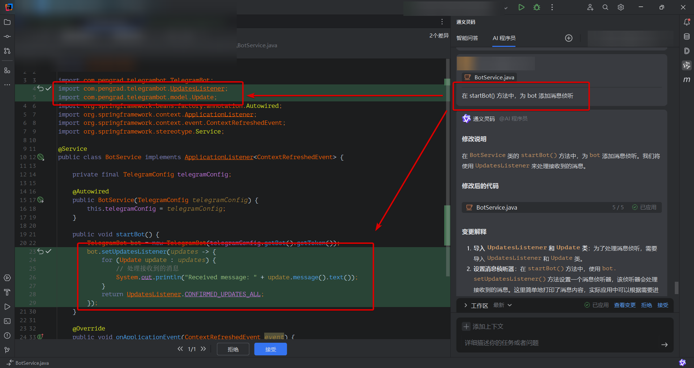

# hydrogen-telegram-bot
This is a Telegram bot that I use for every purpose I can think of.

_本项目第一个 commit 当中 90% 以上的代码（java,xml,properties）内容都是通义灵码的 “AI 程序员” 生成的。_

在 AI 对话过程中，我发送的内容如下：

- 现在我打算创建一个 Maven 项目，这里是一个空的 pom.xml 文件。我们先在里面填充最必要的基本元素。我希望这个项目使用 java 21 作为基础版本。
- 现在这个项目还不是 Spring Boot 项目，我希望这个项目的 pom.xml 中加上相关配置，使其成为一个 Spring Boot 项目
- 我不太喜欢用 parent 来引进 SpringBoot，我希望用 dependencyManagement 来代替 parent
- SpringBoot 的最新版本是 3.4.1，我希望用这个版本，并且将版本号放到 properties 里面
- 现在创建这个项目的主类，完整名字叫 com.hyd.htbot.HydrogenTelegramBotApplication
- 为项目引入 junit 单元测试，不需要指定版本
- 为项目的主类创建单元测试，包含一个空的测试方法即可，用于检查项目能否正常启动。
- 这是一个 Web 项目，添加 Web 和 Thymeleaf 依赖，不需要版本
- 为了方便配置，在 resources 目录下创建 SpringBoot 配置文件，格式为 properties，配置名为 dev
- 将Web端口号改为8901
- 作为一个 Telegram Bot，我们会有一个 TOKEN 的配置项，这个配置项名为 "telegram.bot.token"，它的值放在配置文件里面，并且我们通过一个 JavaBean 来读取这个配置，它完整名字为 con.hyd.htbot.TelegramConfig
- 为了简化配置类的代码，我决定引入 lombok
- 我希望将配置拆分成两层，第一层是 TelegramConfig 对应配置名中的 "telegram"，第二层是 TelegramConfig 内置的静态类名叫 BotConfig，对应配置名中的 "bot"。拆分后不影响 properties 配置文件，但 Bean 的层次更清晰。
- 创建一个 com.hyd.htbot.BotService 类，将其加入 Spring 上下文
- BotService 不需要 getBotToken() 方法，另外创建一个名为 startBot() 的空方法，当 ApplicationContext 刷新后执行。
- 在 startBot() 方法中创建一个 TelegramBot 对象，TelegramBot 类来自 java-telegram-bot-api 依赖库。
- TelegramBot 的完整名字是 com.pengrad.telegrambot.TelegramBot ，更正一下相关的 import
- 在 startBot() 方法中，为 bot 添加消息侦听
- 我希望能在处理接收到的消息时回复消息，先简单回复一个文本消息 "ok"
